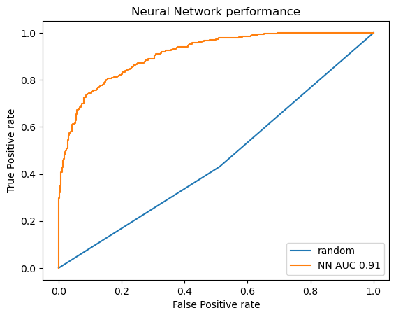

# AIFriendly-circuits

In the present script AI-Friendly learns how to detect if adding a diode will result in it being burnt for different circuits

<b>CIRCUIT 1: RLC-series circuit</b> 
 
In the following figure: qualitatively noting that the simulations were correct - the output signal is the same as the input signal when the frequency is "sufficiently low" 
 
In the following figure: qualitatively noting that the simulations were correct - the resonance curves show the known phenomena of RLC-series resonance
 
 
In the following figure: parameters of the generated database are shown 
 
In the following figure: goodness of fit expressed in a ROC-curve for the predicted values of AI-Friendly 
 

<b>CIRCUIT 2: Sallen-Key low-pass-filter</b> 

 
 

 
 
 

<b>CIRCUIT 3: RC-series low-pass-filter</b> 

 
 

 
 
 

<b>CIRCUIT 4: Amplifier</b> 

 
 

 
 
 

