# AIFriendly-circuits

In the present script AI-Friendly learns how to detect if adding a diode will result in it being burnt for different circuits

---

<b>CIRCUIT 1: RLC-series circuit</b> 

<b> This is the circuit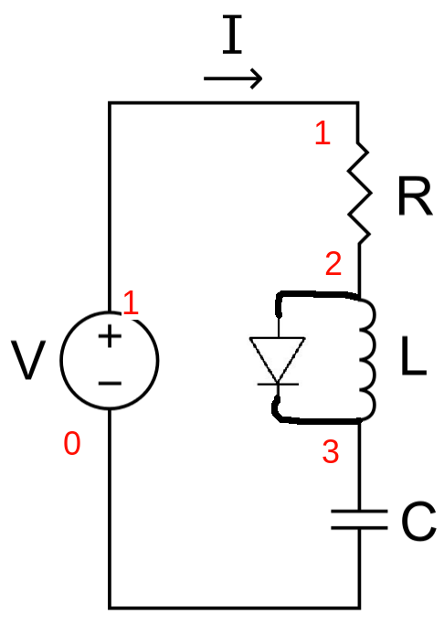 
This are the currents over each passive component 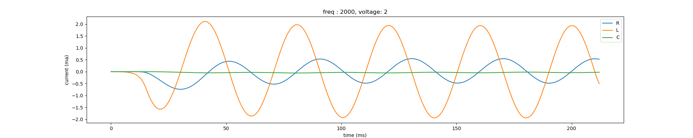 
This are some resonance curves: current over resistance vs freq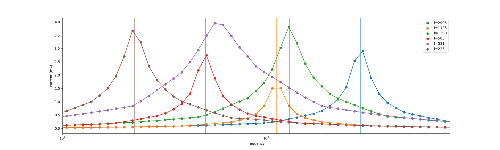 
This are the parameters used to generate the database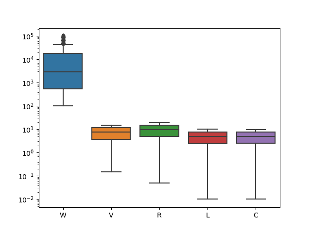 
This is the ROC of AI-Friendly over the database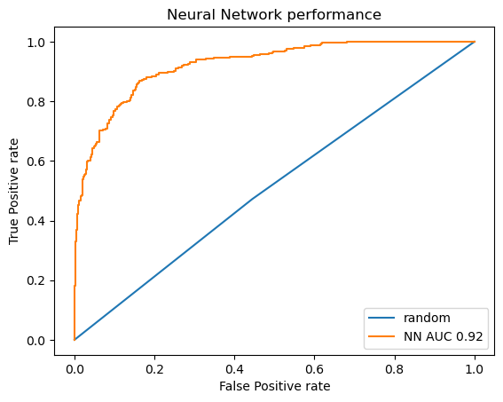 
We conclude it has learnt very well</b>

---

<b>CIRCUIT 2: Sallen-Key low-pass-filter</b> 

<b> This is the circuit 
This are the input and output voltage 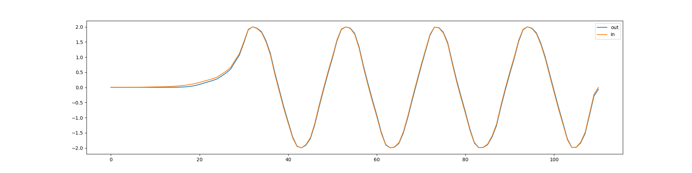 
This are some transmission curves: output voltage over resistance vs freq 
This are the parameters used to generate the database 
This is the ROC of AI-Friendly over the database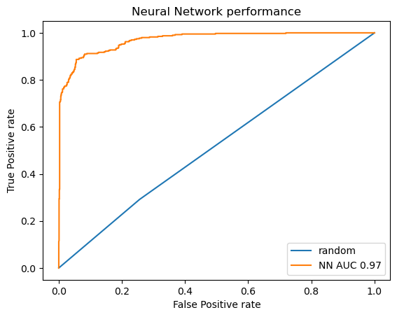 
We conclude it has learnt very well</b>

---

<b>CIRCUIT 2: RC-series low-pass-filter</b> 

<b> This is the circuit 
This are the input and output voltage 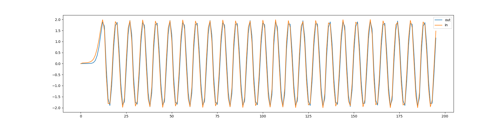 
This are some transmission curves: output voltage over resistance vs freq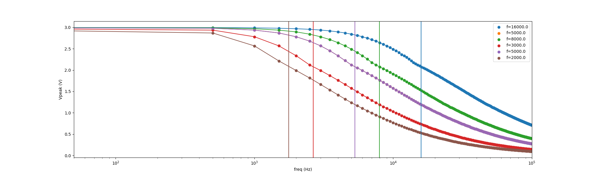 
This are the parameters used to generate the database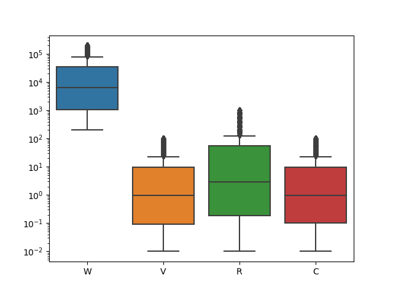 
This is the ROC of AI-Friendly over the database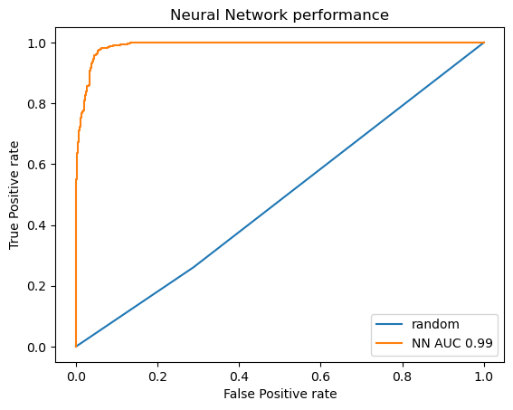 
We conclude it has learnt very well</b>

---

<b>CIRCUIT 2: Amplifier</b> 

<b> This is the circuit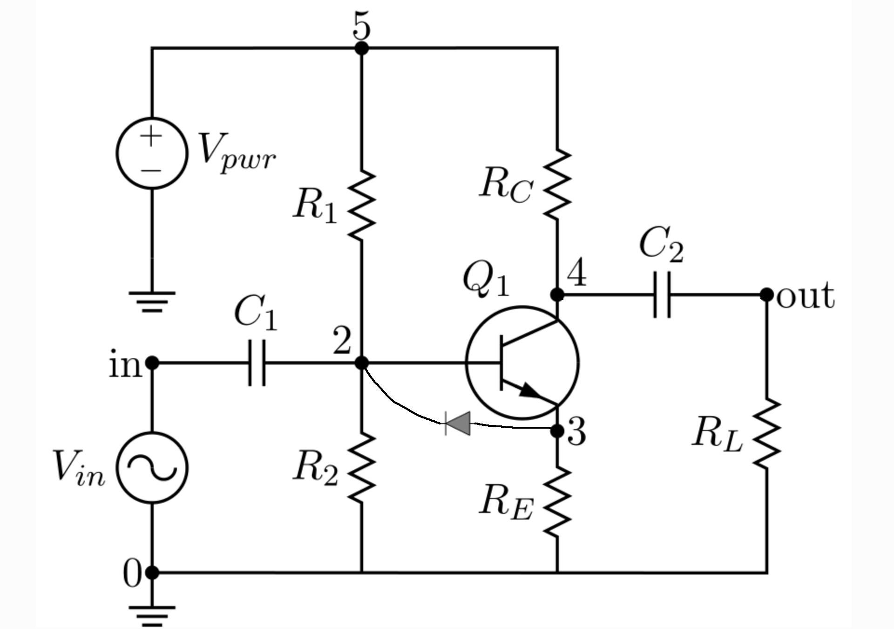 
This are the input and output voltage 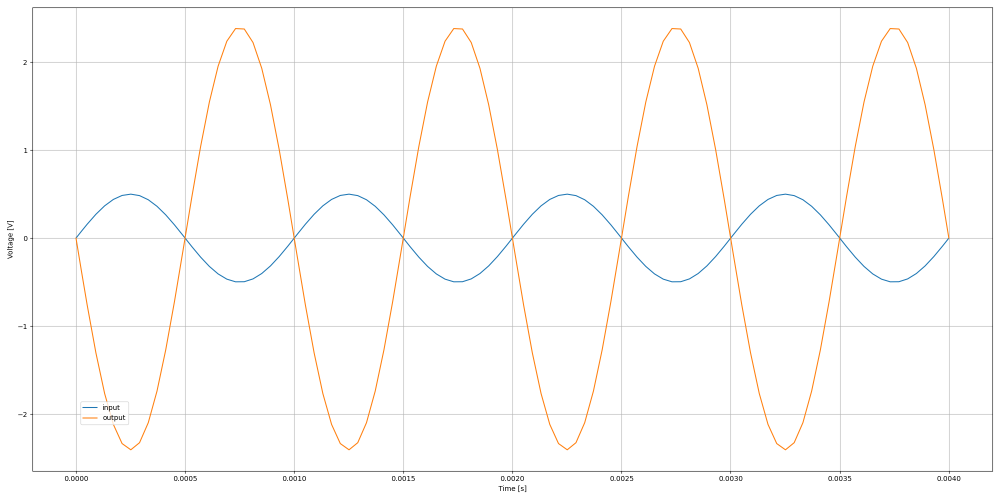 
This are some amplification vs frequency curves: a constant amplification factor should be noted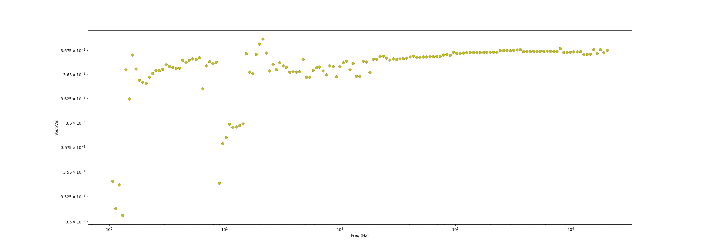 
This are the parameters used to generate the database 
This is the ROC of AI-Friendly over the database 
We conclude it has learnt very well</b>

